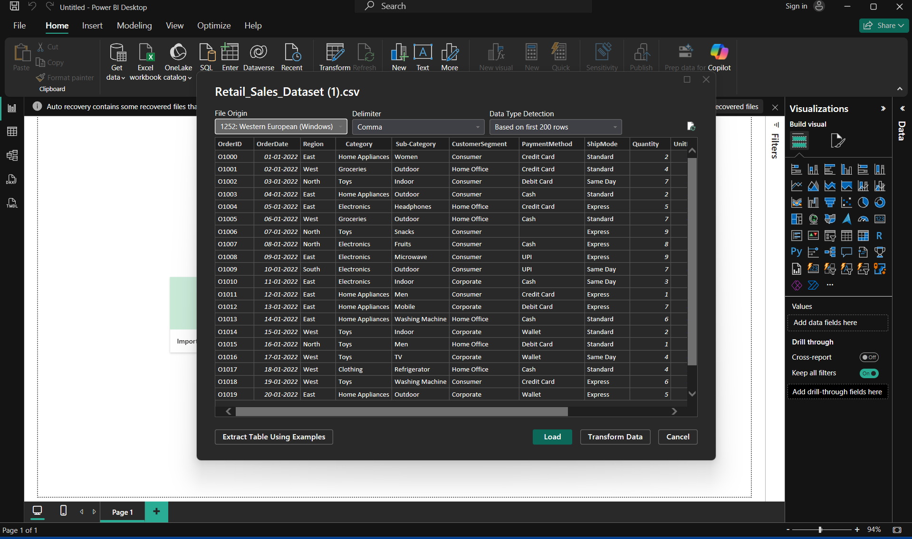
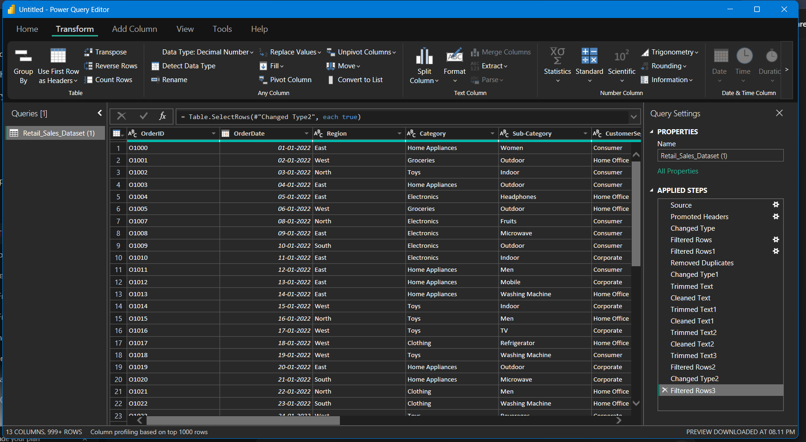
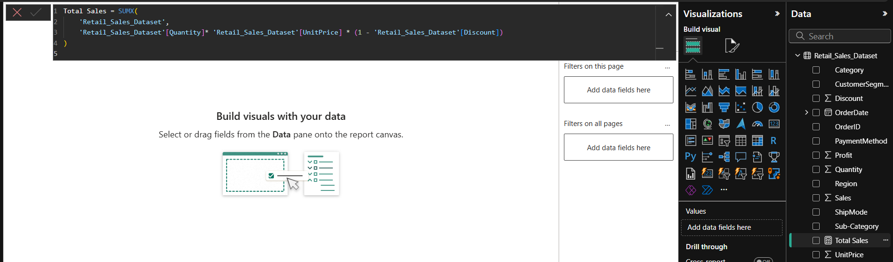
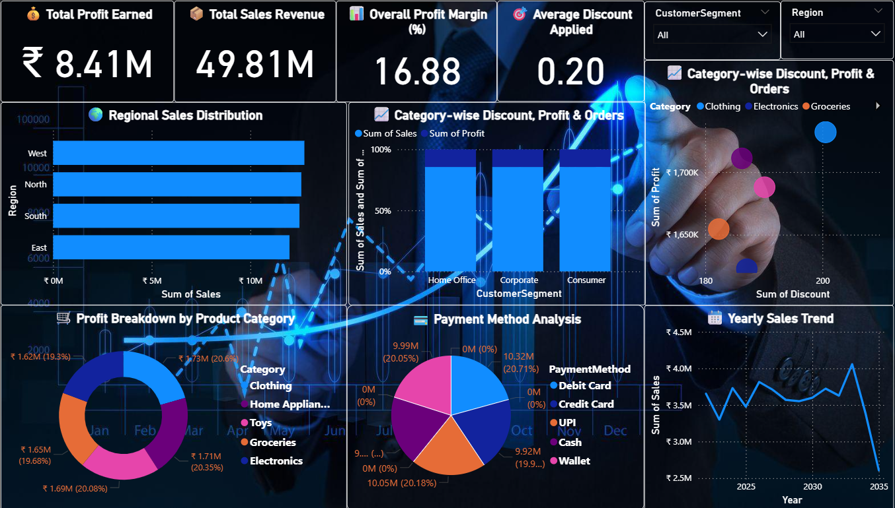

# 📊 Retail Sales Analysis – Power BI Project

[Download Power BI File](Retail-Sales-Analysis.pbix)

  

## 🔎 Overview
This project analyzes a retail sales dataset to uncover key business insights.  
It demonstrates end-to-end steps of a data analytics project using Power BI:

- ✅ Data loading  
- ✅ Data cleaning & transformation  
- ✅ Data modeling & DAX  
- ✅ Interactive dashboard  

## 📂 Dataset & Data Cleaning
**Source:** [Download CSV](Retail_Sales_Dataset.csv)

**Cleaning steps:**
- Removed nulls & duplicates  
- Standardized data types (dates, decimals, text)  
- Trimmed & cleaned text values  
- Filtered invalid rows  

**Screenshots:**
- 
-  

## ⚙️ Data Modeling & DAX
Created calculated columns & measures to analyze sales performance:

Total Sales = SUMX('Retail_Sales_Dataset', 'Retail_Sales_Dataset'[Quantity] * 'Retail_Sales_Dataset'[UnitPrice] * (1 - 'Retail_Sales_Dataset'[Discount]))  
Total Profit = SUM('Retail_Sales_Dataset'[Profit])  
Total Orders = DISTINCTCOUNT('Retail_Sales_Dataset'[OrderID])  
Total Quantity = SUM('Retail_Sales_Dataset'[Quantity])  
Profit Margin % = DIVIDE(SUM(Retail_Sales_Dataset[Profit]), SUM(Retail_Sales_Dataset[Sales])) * 100  
Avg Discount = AVERAGE('Retail_Sales_Dataset'[Discount])  
YOY Sales = CALCULATE([Total Sales], SAMEPERIODLASTYEAR('Retail_Sales_Dataset'[OrderDate]))  

**Screenshot:** 
 

## 📊 Dashboard & Insights
Dashboard includes:
- KPIs: Profit, Sales, Margin, Discount, Orders  
- Regional sales distribution  
- Customer segment & category analysis  
- Payment method breakdown  
- Yearly sales trend  

**Screenshot:**   

## 💡 Key Insights
- Total Sales Revenue reached **49.81M** with **8.41M Profit**  
- Overall Profit Margin = **16.88%**  
- West & East regions are top contributors to sales  
- Clothing, Electronics, and Groceries dominate category sales  
- Debit Card & Credit Card are most used payment methods  
- Seasonal trends indicate fluctuation in sales year-on-year  
- Discounts influence profit margins significantly  

## 🛠️ Tech Stack
- **Tool:** Microsoft Power BI  
- **Language:** DAX for measures  
- **Dataset:** CSV (Retail Sales)
